# MovieApp
Swift ile geliştirilmiş, film ve dizi bilgilerini bir API üzerinden alan mobil uygulama.

# 🎬 Genel Bakış
CineTrack, kullanıcıların film ve dizi içeriklerini keşfetmesini, aramasını ve kişisel ayarlarını yönetmesini sağlayan bir iOS uygulamasıdır. Uygulama modern bir arayüzle birlikte Tab Bar yapısına sahiptir ve Swift ile Xcode kullanılarak geliştirilmiştir.
Bu proje, FLO Teknoloji Hizmetleri A.Ş. bünyesinde yürütülen yazılım geliştirme stajı sürecinde hazırlanmıştır.

# 🚀 Özellikler
  ### 📍 Ana Sayfa (Home):

- Üst kısımda uygulama adını taşıyan bir CineTrack başlığı.

- Açıklayıcı bir yazı bölümü.

- Film aramak için SearchBar.

- Yana kaydırmalı kategorileri gösteren yatay CollectionView.

- Aşağıya kaydırmalı film posterleri içeren CollectionView.

- En altta sayfalar arası geçiş için TabBar.

 ### 🔍 Arama Sayfası (Search):

- Üstte “Search” yazısı olan bir başlık.

- Film aramak için SearchBar.

- Arama sonuçlarını listeleyen dikey CollectionView.

 ### ⚙️ Ayarlar Sayfası (Settings):

- Başlık olarak “Settings” label'ı.

- İçerisinde profil resmi ve iki adet label bulunan bir View.

- Altında ayar seçeneklerini gösteren bir TableView.

# 🛠️ Kurulum

Bu repository'yi klonlayın:

git clone https://github.com/busratosunn/MovieApp

- Movie App.xcodeproj dosyasını Xcode ile açın.

- Simülatör ya da gerçek cihaz seçin.

- Xcode'da Run butonuna basarak uygulamayı başlatın.

# 🎞️ Uygulama Önizlemesi (GIF)

  

# 📸 Ekran Görüntüleri
### 📲 Launch Ekranı
  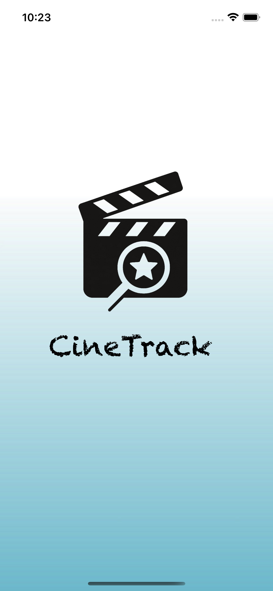
  
  ### 🏠 Ana Sayfa
  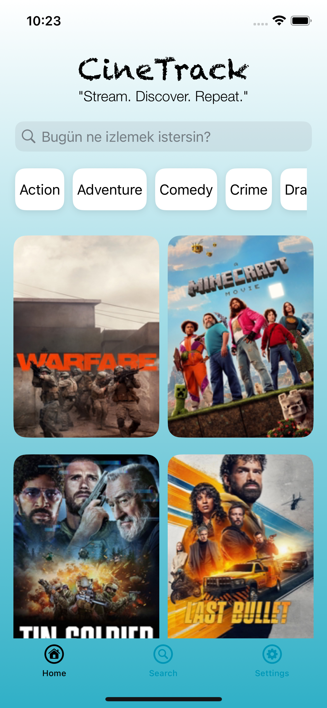
 

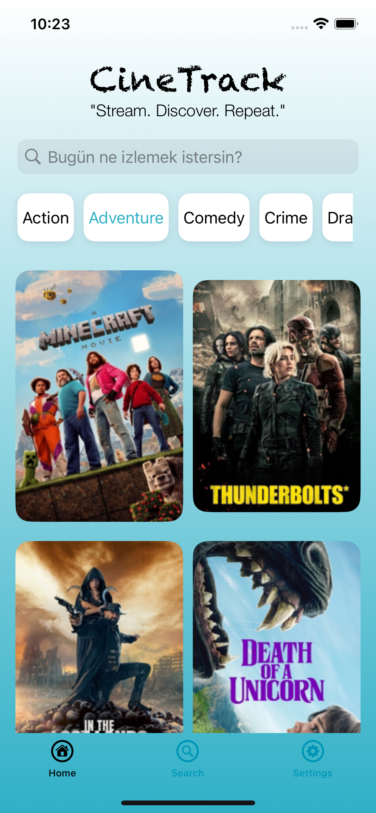
 

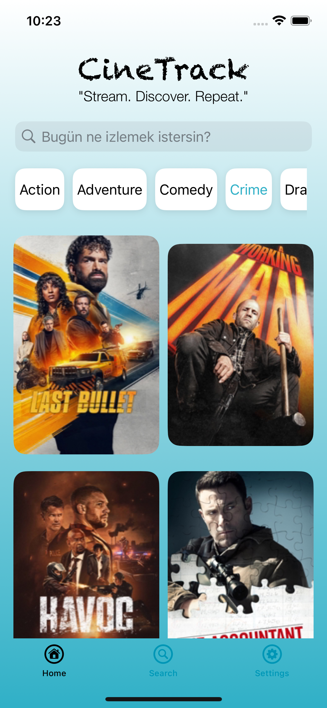
 

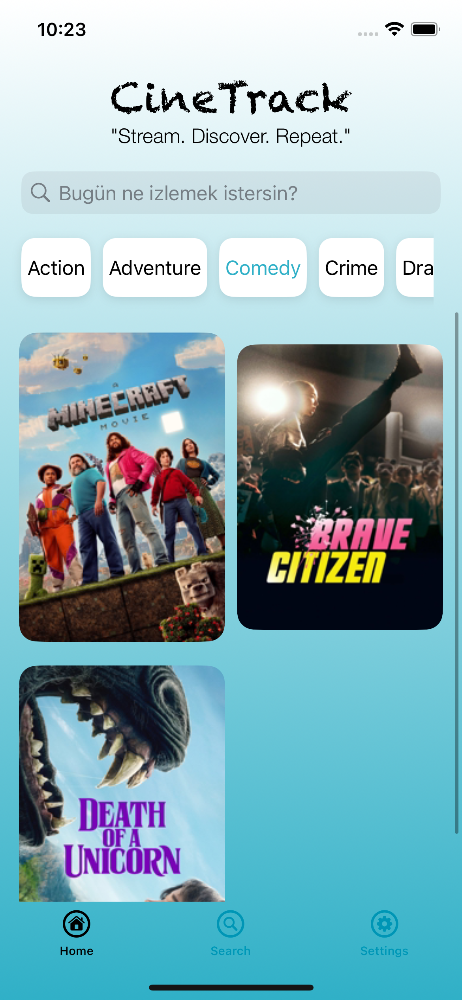
 

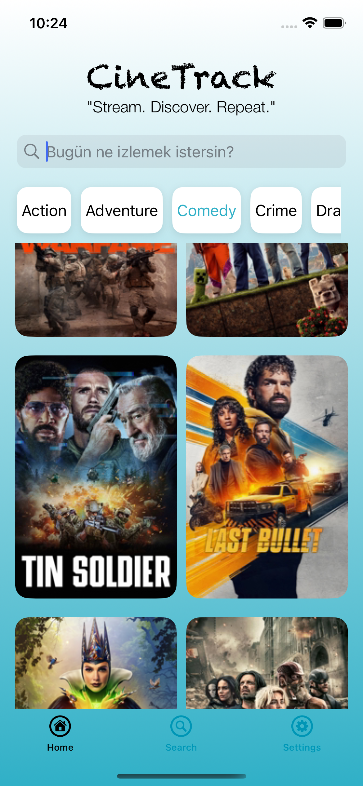
  
  ### 🔍 Arama Sayfası
  <table>
  <tr>
  <td>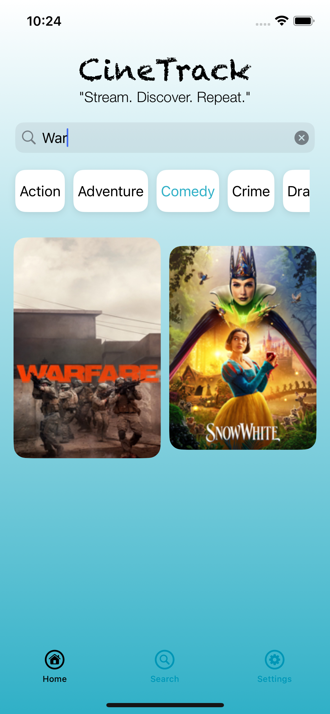</td>
  <td>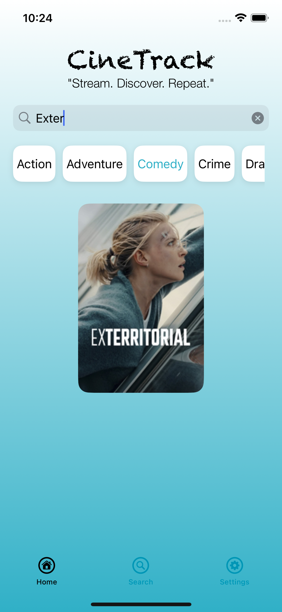</td>
  <td>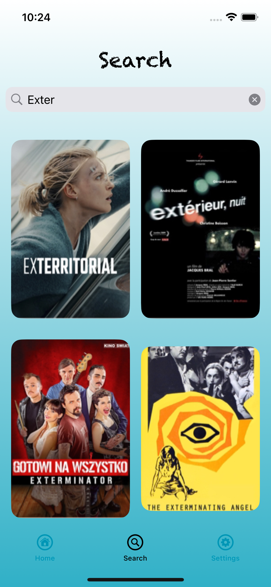</td>
  <td>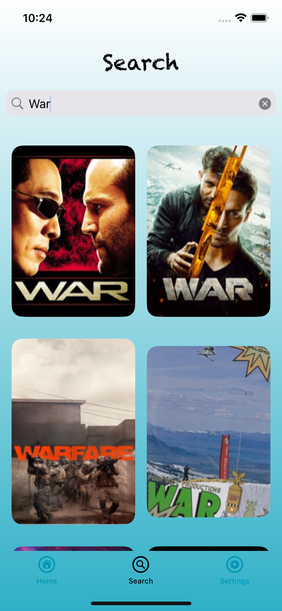</td>
  </tr>
  </table>
  
  ### ⚙️ Ayarlar Sayfası
  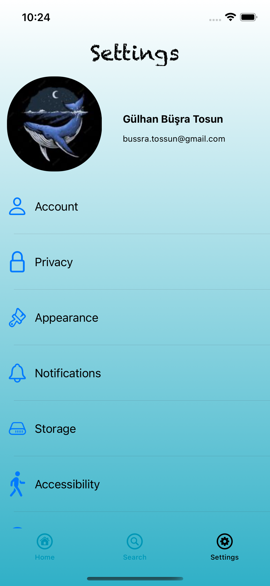

# 📚 Kullanılan Teknolojiler
- **Swift & UIKit**

- **CollectionView & TableView**

- **TabBarController**

- **AutoLayout & StackView**

- **RESTful API kullanımı (JSON verisi ile içerik çekme)**

